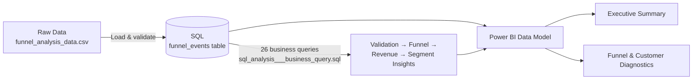

# User Funnel & Revenue Optimization Analysis
### *An End-to-End Data Analyst Project — SQL • Power BI*


> > This project analyzes the complete e-commerce purchase funnel to identify **where users abandon their journey, which customer segments underperform, and what business actions can improve conversion and revenue.** Using SQL for business logic and Power BI for interactive reporting, the project transforms raw event-level data into decision-ready insights for stakeholders.


---

## 📌 Table of Contents
- [Problem Statement](#-problem-statement)
- [Project Architecture](#-project-architecture)
- [Tech Stack](#-tech-stack)
- [Dataset](#-dataset)
- [Project Workflow](#-project-workflow)
- [Power BI Dashboard](#-power-bi-dashboard)
- [SQL Analysis](#-sql-analysis)
- [Key Business Insights](#-key-business-insights)
- [Repository Structure](#-repository-structure)
- [How to Reproduce This Project](#-how-to-reproduce-this-project)
- [Results & Recommendations](#-results--recommendations)
- [Future Improvements](#-future-improvements)
- [About Me](#-about-me)

---

## 🎯 Problem Statement

An e-commerce business observed that a large number of users were visiting the platform, but far fewer were completing purchases. While high-level KPIs indicated a conversion problem, they did not explain **where users were dropping off in the purchase journey, which customer segments were underperforming, or what business actions should be prioritized to improve revenue.**

The business wanted to answer three key questions:

1. **Where does the customer journey break down?**
   Is the largest drop-off occurring between Browse → Add to Cart, Add to Cart → Checkout, or Checkout → Purchase, and which stage should be prioritized for optimization?

2. **Is the problem widespread or concentrated within specific customer segments?**
   Do particular combinations of marketing channel, device, or region perform significantly worse than others, and are those segments large enough to justify business investment?

3. **Which customer behaviors contribute most to lost revenue?**
   Do repeat visitors convert better than first-time visitors? How much revenue is being lost due to cart and checkout abandonment?

To answer these questions, I analyzed raw event-level user data using SQL, performing data validation, funnel analysis, revenue analysis, segmentation, window functions, and multi-CTE business queries. The results were then presented in a two-page interactive Power BI dashboard that enables stakeholders to quickly identify bottlenecks, understand customer behavior, and prioritize actions that can improve conversion and revenue.

---

## 🏗 Project Architecture



**The flow in plain English:**
`Raw Event Data → SQL Validation & Business Queries → Power BI Data Model → 2-Page Dashboard`

---

## 🛠 Tech Stack

| Layer | Tool | Purpose |
|---|---|---|
| **Analysis** | SQL (PostgreSQL syntax) | Data validation, funnel logic, aggregation, window functions, CTEs |
| **BI & Visualization** | Power BI Desktop | Data modeling, DAX measures, 2-page interactive dashboard |

---

## 🗂 Dataset

`funnel_analysis_data.csv` is an **event-level log**: one row per user action, not per session — so a single session appears as multiple rows (Browse, Add to Cart, Checkout, Purchase), each timestamped.

| Metric | Value |
|---|---|
| Total Event Rows | 21,663 |
| Unique Sessions | 10,000 |
| Unique Users | 10,000 |
| Date Range | 01 Oct 2025 – 31 Oct 2025 |
| Total Revenue | ₹11.76L (1,176,405.78) |
| Total Purchases | 1,080 |
| Overall Conversion Rate | 10.80% |
| Cart Abandonment Rate | 84.70% |

**Columns:** `User_ID`, `Session_ID`, `Event`, `Timestamp`, `Device`, `Region`, `Channel`, `Product_Category`, `Revenue`, `Bounce_Flag`

**Funnel stages (in order):** Browse → Add to Cart → Checkout → Purchase

**Dimensions captured:** 4 Regions (North/South/East/West), 4 Channels (Organic/Google Ads/Social Media/Email), 3 Devices (Desktop/Mobile/Tablet), 5 Product Categories (Home/Beauty/Electronics/Fashion/Sports)

> ⚠️ **Data quirk worth noting:** `Device`, `Region`, and `Channel` are recorded per *event*, not per *session* — they can technically vary row-to-row within the same session (e.g. a session might log its Browse event as "Desktop" and its Checkout event as "Tablet"). To avoid double-counting or misattributing a session, all channel/device/region-level queries in this project use a `DISTINCT ON (session_id) ... ORDER BY event_timestamp ASC` CTE to attribute each session to its **first-touch** value — the value at the moment the session started.

---

## 🔄 Project Workflow

### 1️⃣ Data Validation — *SQL*
- Checked row/session/user counts, confirmed no duplicate `(user_id, session_id, event, event_timestamp)` combinations, and verified the four funnel event names had no typos or inconsistent casing.
- Cross-checked revenue against event type — confirming revenue only ever appears on `Purchase` rows, never elsewhere — before trusting any downstream revenue aggregation.

### 2️⃣ Business Insight Queries — *SQL*
- Wrote **26 queries** (`sql_analysis___business_query.sql`) spanning validation, session behavior, funnel conversion, revenue, customer behavior, marketing/channel performance, region, product, device, time, advanced KPIs, window functions, and multi-CTE segmentation.
- Used a **first-touch attribution CTE** (`DISTINCT ON`) wherever channel/device/region needed to represent the whole session rather than a single event row.
- Used a **window function** (`SUM() OVER (ORDER BY ...)`) to build a running total of daily revenue, and a **multi-CTE query** to isolate the single channel + device combination with the worst checkout-to-purchase rate among high-traffic segments — the "problem segment" query.

### 3️⃣ Data Modeling & Visualization — *Power BI*
- Modeled the cleaned event data in Power BI and authored DAX measures for every headline KPI (Total Sessions, Conversion Rate, Total Revenue, AOV, Cart Abandonment Rate, stage-to-stage funnel %, bounce rate).
- Built a **2-page interactive report**: a top-level Executive Summary for stakeholders, and a Funnel & Customer Diagnostics page for the analyst-level segment breakdown.

---

## 📊 Power BI Dashboard

The `.pbix` file contains a **2-page interactive report**:

| Page | What it shows |
|---|---|
| 🟦 **Executive Summary** | KPI cards (Total Sessions, Conversion Rate, Total Revenue, AOV, Cart Abandonment Rate), revenue by region/channel/device, revenue trend by date, and the full user funnel with stage-to-stage % |
| 🟥 **Funnel & Customer Diagnostics** | Stage-to-stage conversion rates, conversion rate by device & channel, bounce rate by device, and a channel × device breakdown table ranked by checkout-to-purchase rate |

### Executive Summary


### Funnel & Customer Diagnostics


---

## 🗄 SQL Analysis

All 26 queries live in [`sql_analysis___business_query.sql`](./sql/sql_analysis___business_query.sql), organized into 13 sections (A–M): Data Validation, Session Analysis, Funnel Analysis, Revenue Analysis, Customer Behaviour, Marketing Analysis, Regional Analysis, Product Analysis, Device Analysis, Time Analysis, Advanced KPIs, Window Functions, and CTEs.

```sql
-- Section M: the "problem segment" — worst checkout-to-purchase rate
-- among channel + device combinations with meaningful traffic (>200 sessions)
WITH session_attribution AS (
    SELECT DISTINCT ON (session_id)
        session_id, channel, device
    FROM funnel_events
    ORDER BY session_id, event_timestamp ASC
),
segment_funnel AS (
    SELECT 
        sa.channel, sa.device,
        COUNT(DISTINCT sa.session_id) AS total_sessions,
        COUNT(DISTINCT CASE WHEN e.event = 'Checkout' THEN e.session_id END) AS checkout_sessions,
        COUNT(DISTINCT CASE WHEN e.event = 'Purchase' THEN e.session_id END) AS purchase_sessions
    FROM session_attribution sa
    JOIN funnel_events e ON sa.session_id = e.session_id
    GROUP BY sa.channel, sa.device
)
SELECT *,
    ROUND(purchase_sessions::numeric / NULLIF(checkout_sessions, 0) * 100, 2) AS checkout_to_purchase_pct
FROM segment_funnel
WHERE total_sessions > 200
ORDER BY checkout_to_purchase_pct ASC
LIMIT 5;
```

This surfaces the exact channel + device pairing that is quietly losing the most checkout-stage revenue — a finding a channel-only or device-only view would miss.

---

## 🔍 Key Business Insights

> *(Derived directly from the SQL queries and dashboard — these are the findings a stakeholder would want on slide one.)*

- 🚨 **Checkout → Purchase is the steepest drop in the funnel, at just 30.65%** — worse than both Browse → Cart (70.59%) and Cart → Checkout (49.92%). 2,444 sessions reach checkout and abandon there.
- 💸 **Cart abandonment rate sits at 84.70%** — of all sessions that ever add an item to cart, the overwhelming majority never complete a purchase.
- 📉 **Overall conversion is 10.80%** (1,080 purchases from 10,000 sessions), with an AOV of ₹1.09K, producing ₹11.76L in total revenue.
- 📱 **Tablet is the weakest device on every metric that matters:** lowest conversion rate (10.38%) *and* highest bounce rate (80.85%) — the only device that's simultaneously worst at converting and worst at retaining.
- 📧 **Email + Tablet is the single worst-performing segment**, converting checkout to purchase at just 26.19% — nearly 4.5 points below the overall average of 30.65%, despite carrying meaningful traffic (793 sessions).
- 🖥️ **Desktop is the strongest performer**, with the highest device conversion rate (11.17%) and the lowest bounce rate (79.41%) — a narrow gap in bounce rate, but a consistent edge across every diagnostic.
- 📣 **Organic and Google Ads are the top-converting channels** (11.19% and 11.02%), slightly ahead of Social Media (10.78%) and Email (10.20%) — but revenue is spread almost evenly across all four channels (₹0.28M–₹0.31M each), meaning conversion efficiency, not just traffic volume, is the real differentiator between channels.

---

## 📁 Repository Structure

```
User-Funnel-Revenue-Optimization/
│
├── README.md                                        # You are here
│
├── data/
│   └── funnel_analysis_data.csv                     # Raw event-level source data (21,663 rows)
│
├── sql/
│   └── sql_analysis___business_query.sql             # Table load + 26 business insight queries
│
├── powerbi/
│   └── User_Funnel___Revenue_Optimization_Analysis.pbix   # Power BI dashboard (2 pages)
│
└── images/
    ├── executive_summary.png
    └── funnel_customer_diagnostics.png
```

> 💡 The folder layout above (`data/`, `sql/`, `powerbi/`, `images/`) is a suggested structure — organizing your repo this way before pushing to GitHub instantly makes it look more professional and easier to navigate.

---

## ⚙️ How to Reproduce This Project

1. **Load the raw data into your SQL engine of choice**
   ```sql
   -- Run in your SQL client (PostgreSQL recommended, given FILTER/DISTINCT ON syntax used)
   CREATE TABLE funnel_events (
       user_id           TEXT,
       session_id        TEXT,
       event             TEXT,
       event_timestamp   TIMESTAMP,
       device            TEXT,
       region            TEXT,
       channel           TEXT,
       product_category  TEXT,
       revenue           NUMERIC,
       bounce_flag       TEXT
   );
   -- Import data/funnel_analysis_data.csv into funnel_events
   ```
2. **Run the business queries**
   ```sql
   :r sql/sql_analysis___business_query.sql
   ```
   This runs all 26 queries across validation, funnel, revenue, customer behavior, marketing, region, product, device, time, advanced KPIs, window functions, and CTE sections.
3. **Open the Power BI report**
   - Launch `powerbi/User_Funnel___Revenue_Optimization_Analysis.pbix` in Power BI Desktop.
   - Point the data source to `funnel_analysis_data.csv` or your SQL table.
   - Refresh to explore both pages: Executive Summary and Funnel & Customer Diagnostics.

---

## ✅ Results & Recommendations

| Finding | Recommended Action |
|---|---|
| Checkout → Purchase converts at only 30.65% — the steepest drop in the funnel | Audit the checkout flow itself (payment options, form length, shipping-cost surprises, page load) before spending more on top-of-funnel acquisition |
| 2,444 sessions abandon after reaching checkout | Trigger a targeted cart/checkout-recovery email or discount nudge for sessions that stall at this exact stage |
| Tablet has both the lowest conversion (10.38%) and highest bounce rate (80.85%) | Run a tablet-specific UX review — the checkout and product pages may not be rendering well on tablet viewports |
| Email + Tablet converts checkout-to-purchase at just 26.19%, well below the 30.65% average | Either fix the tablet checkout experience for email-driven traffic, or shift email campaign budget toward desktop/mobile-optimized landing flows |
| Desktop outperforms on every diagnostic metric | Use Desktop's checkout flow as the design benchmark when redesigning Mobile/Tablet checkout |
| Channel revenue is nearly flat (₹0.28M–₹0.31M) despite conversion rates ranging 10.20%–11.19% | Reallocate a portion of Email/Social budget toward Organic and Google Ads, which convert more efficiently per session |

---

## 🚀 Future Improvements

- Layer in a customer lifetime value (CLV) view by joining repeat-visitor behavior (Section E) with revenue per user, to see if repeat visitors are worth more than their higher conversion rate alone suggests.
- Add a funnel-stage time-decay analysis — how much does conversion probability drop for every extra minute spent between Browse and Purchase?
- Extend the "problem segment" CTE logic into a scheduled query that flags newly-underperforming channel × device pairs each week, rather than a one-time snapshot.
- Add a third Power BI page dedicated to product-category performance, since product-level revenue and conversion currently live only in the SQL layer.
- Pair the SQL cart-abandonment value (Section E, Q2) with a DAX measure in Power BI so "lost revenue at checkout" becomes a headline KPI card, not just a query result.

---

## 👤 About Me

This project was built end-to-end as a **Data Analyst portfolio project**, covering the full analytics lifecycle: **SQL Business Logic → Insight Extraction → Power BI Storytelling.**

📧 **Feel free to connect with me for feedback, questions, or opportunities!**

⭐ If you found this project useful or interesting, consider giving it a star on GitHub!
